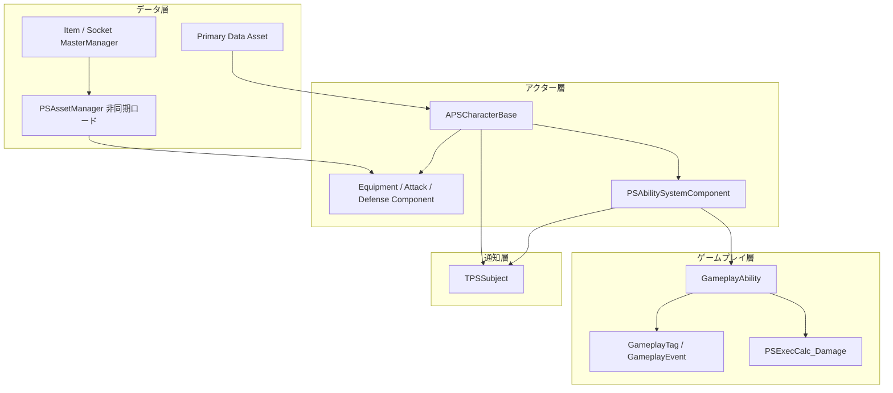

# Project Shield
## 開発環境
- 開発規模：個人開発
- 使用ツール：Unreal Engine 5、C++、Gameplay Ability System（GAS）

## プレイ動画（Youtube）
[](https://www.youtube.com/watch?v=0ajlNry9anA)

---

## 概要
3Dのソウルライクアクションゲーム。
プレイヤーは攻撃できず、盾による受け止め・受け流し・受け返しをすることで敵の攻撃を防ぎます。プレイヤーは敵の攻撃を防御して、敵のブレイク値を貯めてスタン状態を狙います。

## 資料
`Source`フォルダにソースコードがカテゴリーごとに分けられ入っています。

### ソース構成概要

```text
Source/ProjectShield/
├── Character/          # APSCharacterBase（GAS・装備・攻防コンポーネントのハブ）
├── Player/             # プレイヤー、コントローラ、入力
├── Enemy/              # 敵キャラクター・AI
├── Components/         # 攻撃トレース、防御判定、ロックオン
├── Equipment/          # 装備コンポーネント、武器・盾アクタ
├── GAS/                # ASC、AttributeSet、Ability、GameplayTag、ダメージ計算
├── Data/               # Primary Data Asset（キャラ・装備・ソケット）
├── Singleton/          # GameInstanceSubsystem、マスターデータ管理
├── Utility/Observer/   # TPSSubject（独自イベント）
├── UI/                 # HUD ウィジェット
├── Animation/          # AnimNotify からの GameplayEvent 送信
└── BehaviorTree/       # AI タスク・サービス
```

### アーキテクチャ概要



## アピールポイント
- `Gameplay Ability System`（GAS）を用いた拡張性・保守性を重視した設計
- `GameplayTag`を使ったタグによるイベント駆動
- マスターデータを管理するシングルトンクラスを用いたメモリやCPU負荷を軽減した実装
- `Primary Data Asset`を使ったデータ駆動
- アイテムID依存の装備システム`EquipmentComponent`
- コンポーネントやアビリティを駆使したクラスの疎結合
- 独自のデリゲートイベントシステム`Subject`を使ったイベント駆動

## 設計思想
根本的な目的は、プロジェクトの**拡張性・保守性**を上げることです。

### Gameplay Ability Systemを採用した理由
主に戦闘システムの実装のために採用しました。

大きな理由としては、**キャラクターとアビリティを分離できること**です。このゲームでは、プレイヤーは様々な盾などの装備品を装備できる仕様となっており、装備する盾によって構えた時の効果やアニメーションなどが違います。例えば軽い盾は構えが早いアニメーションを使用して、重い盾は構えるのに時間がかかるアニメーションを使うなどです。他にもパリィするのにチャージする必要があるものなど、特殊な効果を持つ盾を実装する可能性があります。そこで、**キャラクターに固定の能力を実装するのではなく、装備する盾側が能力を付与してくれるような構造にする必要がありました**。よって、`GAS`を使うことで、今後特殊な能力を付与するような盾を実装する場合でも安定して実装することができ、拡張性の高い設計となるから採用しました。

### イベント駆動
クラス間の通信の安全性を高めるためにイベント駆動を意識しました。以前に開発したゲームでは、直接外部のクラスの関数を実行するなどして通信していましたが、規模を拡大すると実行する側のクラスに責任や依存度が大きくなり、汎用性が低く再利用性が下がったり関数名や引数などをうかつに変更しづらくなったりする問題が出てきます。

このプロジェクトでは大きく2種類のイベントシステムを利用しています。

1つ目は**独自に実装したデリゲートイベントシステム**`Subject`です。わざわざ独自のシステムを使っている理由は、開発初期時に、Unreal Engine側が用意しているマクロで登録する`DECLARE_MULTICAST_DELEGATE`は個人的に使いづらいと感じたからです。まず、イベントを作成するたびに型名を考える必要があり、マクロで登録するのがスマートではないと感じていました。また、マクロでグローバルに型名を考えるので、外部のクラスのデリゲートと型名が一致して衝突する可能性もあると思ったからです。もともとUnityの開発に慣れていたこともあり、**UnityのRxのようなイベントシステムをC++でも使えるようにしたいと考え**、独自に`Subject`を実装しました。

2つ目は`GameplayTags`**を使ったタグを使ったイベントシステム**です。主に戦闘システム部分での状態イベントで利用しています。タグを使ったイベントシステムの利点は、**通信するお互いのクラスが完全に疎結合になることです**。デリゲートイベントシステムでは、購読側がイベントを配信するクラスを認知する必要がありますが、タグを使ったイベントシステムはお互いにタグのみを認知するので比較的疎結合であると言えます。なので、戦闘システムでの状態イベントのような、イベントに対して複数のクラスが購読するような構造のようなときに安全性が高くなります。

使い分けとしては、**イベントに対して関わるクラスが少なく規模を大きくする予定がないようなクローズなイベントの場合は`Subject`のデリゲートイベントシステムを採用し、戦闘システムなどのイベントに対して関わるクラスが多くオープンなイベントの場合は`GameplayTags`を使ったイベントシステムを採用しています。**

### データ駆動
ロジックとデータを分離することで、コードのマジックナンバーを減らし、コーディングせずにレベルデザインや難易度調整などが簡単に可能になり、拡張性・保守性が増すように意識しました。

主に`PrimaryDataAsset`と`AssetID`を使うことで、データを管理しています。Unreal Engine のエディタでデータを作成し、簡単にデータを入力できます。そのデータを、**マスターデータを管理する`ItemMasterMangaer`を使って各クラスが自由にデータを取得できるようになっています。特定のクラスだけがデータを使えるような構造にせず、マスターデータマネージャーを入口に誰でもデータを取得できるようにしました**。データの取得には非同期ロードを使っています。

## 現状の課題と解決策
### プレイヤークラスの単一責任原則違反
`APSPlayerCharacter`が中継役としてイベントの購読を行っている処理があります。UIの更新などの処理をプレイヤーが属性値の更新イベントに対して中継して購読しています。当初はプレイヤーのような上位クラスが下位クラスの管理として、責任を集中させた方がいいと思ってこのような設計にしていました。しかし、今後、プレイヤーではなくNPCクラスなどの近いクラスを実装するときに、NPCクラスにも同様の橋渡し処理を書かなくてはいけません。コンポーネント指向は上位クラスが通信してくれるものではなく、コンポーネントを付属するだけで使えるようになる設計がクリーンだと考えます。**上位クラスはオブジェクトの実体として意識を持たせ、コンポーネントや属性値などの下位クラスは付属させるだけで自動的に通信を行えるようにする設計が拡張性・保守性を高めると気づきました**。

#### 改善策
今回はUIの更新をプレイヤークラスがイベントを購読して実行してあげるという構図なので、UIがそれぞれ独自に属性値の更新イベントを購読する設計にする必要があります。**クラス間の依存度を減らして、それぞれのクラスが独立して動かせるような設計にする必要が重要だと思いました**。

### `APSCharacterBase`への依存度が高すぎる
**攻撃アビリティやダメージ計算、コンポーネントなどがコード中に`Cast<APSCharacterBase>`を書いており、多くのクラスが`APSCharactereBase`への依存度が高くなっています**。目的は`APSCharacterBase`が所持しているコンポーネントやイベントにアクセスするためです。当初は`APSCharacterBase`がキャラクター全てのベースクラスであることから問題ないと思っていましたが、キャラクター以外にもなにかアクションを行うような実装をするときに大幅な変更が必要になります。例えば、ダメージを受けるのがキャラクターだけではなく、木箱などの静的なオブジェクトも対象である場合、この設計は破綻する可能性が高くなっています。

#### 改善策
**インターフェースを導入して、コンポーネントを持っているクラスというように基底クラスより抽象度を上げてアクセスするようにします**。`APSCharacterBase`や`APSWoodenBox`などのクラスは`IComponentInterface`のようなインターフェースを追加で継承することで、機能と役割を分離して、役割を表すクラスに依存しすぎないようにします。使用する側はインターフェースに依存するため、依存度が分散して木箱もダメージを受けるように実装しようとしても、新たに木箱クラスにインターフェースを追加で継承させてその中身を実装するだけで済みます。

### 装備システムが非同期ロード中にリクエストがあったときにも対応できていない
`UPSEquipmentComponent`の`Equip()`はアイテムのIDを指定するだけで簡単にマスターデータから装備データを取得して非同期ロードを用いながらスマートに装備するシステムです。しかし、**装備リクエストを送って非同期ロードが完了していないときに立て続けに装備変更リクエストがあった場合、動作が保証されていません**。

#### 改善策
非同期ロードが完了していないときに装備リクエストがあった場合は、非同期ロードを停止して装備ロジックを始めるように修正する必要があります。また、装備を解除する`RemoveEquipment()`の方でも非同期ロードが完了していない場合はロードを停止するような処理が必要になります。**非同期ロードを扱う場合は、ロードハンドルを用いて安全に制御することが重要になります**。
